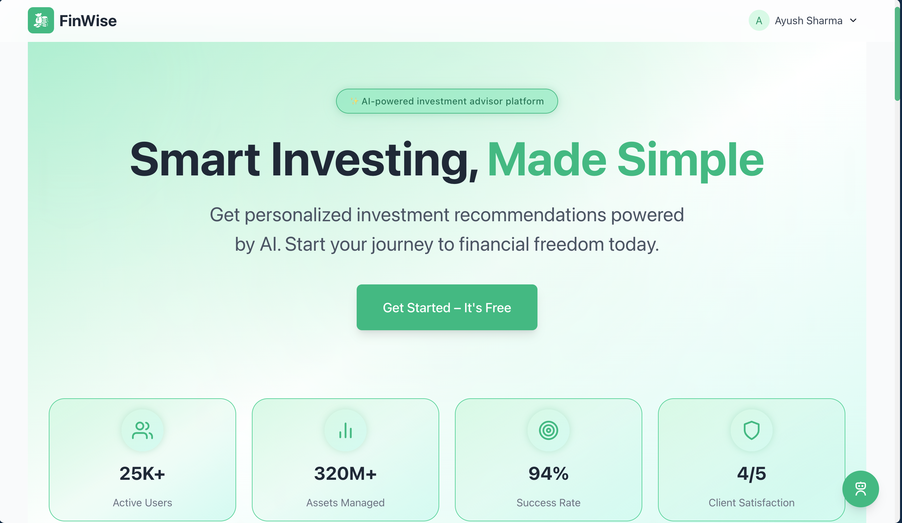

<div align="center">
  
</div>

# 💼 FinWise – AI-Powered Investment Assistant

🔗 **Live Demo:** [finwise.ayush-sharma.in](https://finwise.ayush-sharma.in)

**FinWise** is an AI-powered investment platform that helps beginners understand and plan their investments based on risk, capital, age, and financial goals. Powered by **Gemini AI**, real-time gold prices, and a clean UI — FinWise explains everything in a way even an 18-year-old can understand.

---

## 🚀 Features

- 🤖 Gemini AI-powered **personalized fund suggestions**
- 📈 **Live gold rate integration** via MetalsAPI
- 💬 **AI Chatbot (FunBot)** for financial queries
- 📚 Beginner-focused **blog section** with Gemini-powered summarization
- 🎓 “I’m 18” mode to simplify complex concepts
- 📝 Multi-step **profile form** for goal & risk-based investing
- 🔐 Auth with Appwrite (MVP-ready)
- ⚡ Smooth UX with Framer Motion + Tailwind CSS

---

## ⚙️ Tech Stack

| Category       | Stack                                       |
|----------------|---------------------------------------------|
| **Frontend**   | React, Tailwind CSS, Framer Motion          |
| **Backend**    | Appwrite (Auth & DB), Node.js (planned)     |
| **AI**         | Gemini API (Google AI)                      |
| **APIs**       | MetalsAPI (Gold Prices), Hardcoded MF data  |
| **Dev Tools**  | Vite, React Icons, GitHub Actions (optional)|

---

## 🧪 Environment Variables

Create a `.env` file in the root directory and add the following:

```env
VITE_APPWRITE_PROJECT_ID=your_appwrite_project_id
VITE_APPWRITE_ENDPOINT=https://cloud.appwrite.io/v1
VITE_APPWRITE_DATABASE_ID=your_database_id
VITE_APPWRITE_COLLECTION_ID=your_collection_id
VITE_GEMINI_API_KEY=your_gemini_api_key
VITE_METALS_API_KEY=your_metals_api_key
```

---

## 🛠️ Getting Started

```bash
# 1. Clone the repo
git clone https://github.com/Glucon-D/FinWise.git
cd FinWise

# 2. Install dependencies
npm install

# 3. Add environment variables
cp .env.example .env
# Fill in the actual keys in the .env file

# 4. Run the app locally
npm run dev
```

---

## 👨‍💻 Meet the Team

| Name            | Role                     |
|-----------------|--------------------------|
| **Ayush Sharma**     | 👨‍💻 Lead Developer             |
| **Vranda Garg**      | 🔧 Co-Lead (Backend)            |
| **Atishay Jain**     | 🧪 QA & Graphics Design         |
| **Raghav Gaba**      | 💻 Frontend Developer           |
| **Raghav Katta**     | 💻 Frontend Developer           |

---

## 📸 Screenshots

> You can add preview screenshots or GIFs here from your `/public` folder.

---

## 📄 License

This project is built for educational and hackathon purposes.  
FunWise is not a SEBI-registered advisor. All content is for informational use only.

---
## 📧 Contact

Questions? Reach out at: contact@ayush-sharma.in

---

## 💬 Feedback

Got feedback or ideas? [Create an issue](https://github.com/Glucon-D/FinWise/issues) or reach out to the team!

---

🧠 _“Invest smart, even if you're just starting out.” – FinWise_
